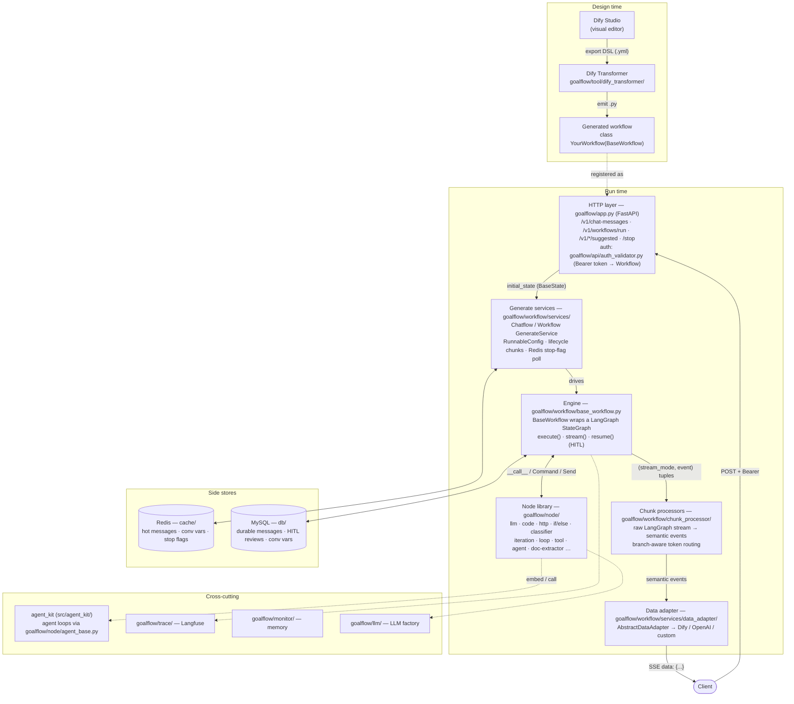

# goalflow

**English** | [简体中文](README.zh-CN.md)

[](./pyproject.toml)
[](./LICENSE)

**G**raph-**O**rchestrated **A**gent **L**oop — a production-grade framework for building LLM applications on top of [LangGraph](https://github.com/langchain-ai/langgraph). It gives you two complementary ways to build:

- **Visual-first workflows** — design a flow in [Dify](https://dify.ai)'s drag-and-drop editor, then transpile the exported DSL into a runnable, version-controllable LangGraph Python file with one command. No lock-in to Dify's runtime.
- **Code-first agents** — build ReAct / Deep / custom agent loops with the bundled `agent_kit` SDK (vendored under `src/agent_kit/`), complete with middleware, model routing, failover, skills, and observability.

Because plain workflow graphs and plain agent loops each have limits, the framework is designed so you can combine them: a `graph` node can host an `agent` loop, and an agent can call sub-workflows as tools.

> [!NOTE]
> **Lean footprint, real concurrency.** In load testing, a two-replica deployment on just **2 vCPU / 4 GB RAM per replica** sustained **100 concurrent conversations with no measurable regression in time-to-first-token**. The streaming pipeline is async and I/O-bound end to end, so throughput scales with replicas rather than demanding heavier boxes.

> [!WARNING]
> **Before you publish this repository publicly, read [docs/security-and-open-sourcing.md](docs/security-and-open-sourcing.md).** The `.env*` files are no longer tracked (a `.env.example` template ships in their place), but real credentials still live in **git history** — they must be scrubbed (`git filter-repo`) and rotated before the first public push. Internal service URLs are also still hard-coded in a few places.

---

## Why this framework

| Need | What it gives you |
|------|-------------------|
| Design flows visually, run them yourself | Dify DSL → LangGraph `.py` transpiler ([docs/dify-transformer.md](docs/dify-transformer.md)) |
| Rich built-in node library | 20+ nodes: LLM, code, HTTP, if/else, classifier, iteration, loop, tool, agent, doc-extractor … ([docs/nodes.md](docs/nodes.md)) |
| Swap the wire protocol | Pluggable `DataAdapter` — Dify protocol by default, OpenAI-compatible included, bring your own ([docs/protocols-and-adapters.md](docs/protocols-and-adapters.md)) |
| Reusable, LLM-matched capabilities | Markdown `SKILL.md` skills, matched to queries and injected into prompts ([docs/skills.md](docs/skills.md)) |
| Real agent loops | vendored `agent_kit` package: Agent + middleware + harness ([docs/agent-kit.md](docs/agent-kit.md)) |
| Conversation persistence | Redis (hot) + MySQL (durable), ES planned ([docs/storage-and-config.md](docs/storage-and-config.md)) |
| Streaming, SSE, HITL | Token streaming with branch-aware routing, human-in-the-loop interrupts ([docs/streaming-and-hitl.md](docs/streaming-and-hitl.md)) |
| Observability | Langfuse tracing + memory-leak monitoring |
| Run cheap, scale horizontally | Async I/O-bound pipeline — 100 concurrent conversations on 2 vCPU / 4 GB × 2 replicas with no first-token regression |

---

## Documentation map

Start here, then follow the links into the topic files under [`docs/`](docs/).

1. **[Getting Started](docs/getting-started.md)** — install, configure, run the server, register your first workflow.
2. **[Architecture](docs/architecture.md)** — the big picture: request lifecycle, the three-layer streaming pipeline, how the pieces fit.
3. **[Nodes Reference](docs/nodes.md)** — every built-in node, its purpose, config, and Dify mapping.
4. **[Dify Transformer](docs/dify-transformer.md)** — convert a Dify DSL export into a runnable workflow file.
5. **[Protocols & Data Adapters](docs/protocols-and-adapters.md)** — the interaction-protocol abstraction and how to implement a custom one.
6. **[Streaming & HITL](docs/streaming-and-hitl.md)** — the streaming/SSE model and human-in-the-loop interrupts.
7. **[Skills](docs/skills.md)** — authoring `SKILL.md`, matching, and prompt injection.
8. **[Agent Kit](docs/agent-kit.md)** — the vendored `agent_kit` SDK: Agent, graph builders, middleware, harness.
9. **[Storage & Config](docs/storage-and-config.md)** — Redis/MySQL persistence, config files, environment variables.
10. **[API Reference](docs/api-reference.md)** — HTTP endpoints (chat, workflow, HITL, report, suggested questions).
11. **[Security & Open-Sourcing Checklist](docs/security-and-open-sourcing.md)** — **read before publishing.**
12. **[Design Notes & Improvement Suggestions](docs/design-notes.md)** — honest assessment and concrete refactors.

---

## Architecture at a glance



See [docs/architecture.md](docs/architecture.md) for the annotated walkthrough of each layer and the full request lifecycle.

---

## Quick glance at the flow

```
Dify Studio (visual design)
        │  export DSL (.yml)
        ▼
goalflow/tool/dify_transformer/wf_code_generator.py  ──►  your_workflow.py
        │                                              (class YourWorkflow(BaseWorkflow[BaseState]))
        ▼
FastAPI (goalflow/app.py)
  POST /v1/chat-messages ── Bearer token ──► auth_validator maps token → Workflow instance
        │
        ▼
ChatflowGenerateService.generate(state)
        │  drives  BaseWorkflow.stream()  (LangGraph)
        ▼
StreamProcessor (semantic events) ──► DataAdapter (Dify / OpenAI / custom) ──► SSE to client
        │
        ├─ Redis  (message cache, conversation variables, stop flags)
        └─ MySQL  (durable messages, HITL reviews, conversation variables)
```

See [docs/architecture.md](docs/architecture.md) for the annotated version.

---

## Requirements

- Python 3.12 (see [`requirements.txt`](requirements.txt))
- Redis (cluster or standalone) and MySQL

```bash
git clone <your-repo-url>
cd goalflow
cp .env.example .env          # then fill in real values

# editable install — puts the `goalflow` package on your path
pip install -e .

goalflow-server                   # serves on http://localhost:8000
# or, without installing:  python start_server.py
```

The project uses a `src/` layout: the framework lives under [`src/goalflow/`](src/goalflow/) (imports as `goalflow.*`, e.g. `from goalflow.node import LLMNode`) and the vendored agent SDK under [`src/agent_kit/`](src/agent_kit/) (imports as `agent_kit.*`). No git submodules — everything is self-contained. Full setup and environment configuration is in [docs/getting-started.md](docs/getting-started.md).

---

## Project layout

```
goalflow/
├── pyproject.toml             # packaging, deps, console script (goalflow-server)
├── start_server.py            # uvicorn launcher (dev, no install needed)
├── bootstrap_paths.py         # sys.path shim so `src/` is importable without install
├── config.yaml                # server/logging config
├── .env.example               # environment template (copy to .env)
├── Dockerfile
├── src/
│   ├── goalflow/                    # the framework package — imports as `goalflow.*`
│   │   ├── app.py               # FastAPI app + all HTTP endpoints
│   │   ├── config.py            # settings, structlog logging, contextvars
│   │   ├── constants.py         # WfNodeType and framework-wide enums
│   │   ├── workflow_types.py    # shared config/type models
│   │   ├── errors.py
│   │   ├── state/               # BaseState (the shared LangGraph state) + reducers
│   │   ├── node/                # built-in node library (+ node/custom/, agent_base.py)
│   │   ├── visitor/             # turns Dify graph nodes into code/objects
│   │   ├── workflow/
│   │   │   ├── base_workflow.py # BaseWorkflow: wraps a LangGraph StateGraph
│   │   │   ├── services/        # generate services + data_adapter/ (protocol layer)
│   │   │   ├── chunk_processor/ # raw LangGraph stream → semantic events
│   │   │   ├── stream/          # answer/end stream routing + template parsers
│   │   │   └── utils/           # checkpointer + connection wrappers
│   │   ├── dify_parser/         # Dify DSL YAML → internal graph model
│   │   ├── tool/                # transpiler, HTTP/SSE clients, OSS, MCP, metrics
│   │   ├── skill/               # skills engine
│   │   ├── llm/                 # LLM factory
│   │   ├── cache/ db/ service/  # Redis + MySQL persistence
│   │   ├── api/                 # auth, HITL, report endpoints
│   │   ├── trace/ monitor/      # Langfuse tracing + memory monitoring
│   │   └── prompts/             # prompt templates
│   └── agent_kit/               # vendored agent SDK — imports as `agent_kit.*`
├── skills/                      # example SKILL.md skills (data, not code)
├── test/                        # unit + integration tests
└── docs/                        # documentation
```

---

## Status & roadmap

This framework is extracted from an internal production system, so some pieces are opinionated toward that origin (Alibaba Cloud OSS, Qwen/DashScope defaults). The generalizable core — the node library, the Dify transpiler, the adapter abstraction, and the agent kit — stands on its own.

Planned / suggested directions (details in [docs/design-notes.md](docs/design-notes.md)):

- Migrate durable message storage from MySQL to Elasticsearch.
- Support visual tools beyond Dify (one-click transpile from other builders).

---

## License

Released under the [MIT License](LICENSE). The vendored `agent_kit` package (`src/agent_kit/`) is relicensed under MIT as part of this project — see [src/agent_kit/NOTICE.md](src/agent_kit/NOTICE.md).
