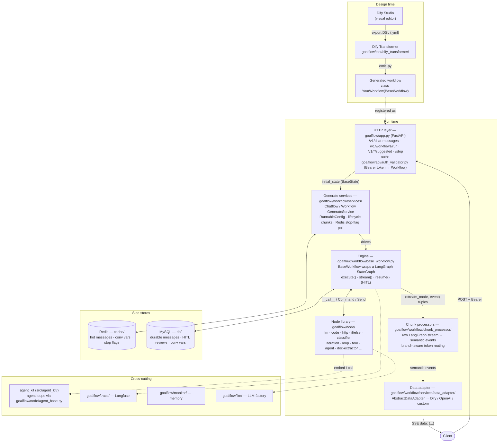

# goalflow

[English](README.md) | **简体中文**

**G**raph-**O**rchestrated **A**gent **L**oop —— 一个基于 [LangGraph](https://github.com/langchain-ai/langgraph) 构建 LLM 应用的生产级框架。它提供两种互补的构建方式:

- **可视化优先的工作流** —— 在 [Dify](https://dify.ai) 的拖拽编辑器里设计流程,然后用一条命令把导出的 DSL 转译成可运行、可版本管理的 LangGraph Python 文件。不绑定 Dify 运行时。
- **代码优先的智能体** —— 用内置的 `agent_kit` SDK(已 vendor 到 `src/agent_kit/`)构建 ReAct / Deep / 自定义智能体循环,配套中间件、模型路由、故障转移、技能与可观测性。

由于纯工作流图与纯智能体循环各有局限,本框架从设计上支持二者组合:一个 `graph` 节点可以承载一个 `agent` 循环,而一个智能体也可以把子工作流当作工具来调用。

> [!NOTE]
> **轻量部署,真实并发。** 在压测中,双副本部署、每副本仅 **2 vCPU / 4 GB 内存**,即可支撑 **100 路并发会话且首 token 延迟无可测退化**。流式管线端到端为异步、I/O 密集型,因此吞吐随副本水平扩展,而非依赖更高配的机器。

> [!WARNING]
> **在将本仓库公开发布前,请先阅读 [docs/security-and-open-sourcing.md](docs/security-and-open-sourcing.md)。** `.env*` 文件已不再被 git 跟踪(改为提供 `.env.example` 模板),但真实凭证仍存在于 **git 历史** 中 —— 首次公开推送前必须用 `git filter-repo` 清除并轮换。此外仍有少量内部服务地址硬编码在代码里。

---

## 为什么选择这个框架

| 需求 | 它提供什么 |
|------|-----------|
| 可视化设计流程,自己运行 | Dify DSL → LangGraph `.py` 转译器([docs/dify-transformer.md](docs/dify-transformer.md)) |
| 丰富的内置节点库 | 20+ 节点:LLM、代码、HTTP、条件分支、分类器、迭代、循环、工具、智能体、文档抽取 …([docs/nodes.md](docs/nodes.md)) |
| 可替换的通信协议 | 可插拔 `DataAdapter` —— 默认 Dify 协议,内置 OpenAI 兼容,也可自带实现([docs/protocols-and-adapters.md](docs/protocols-and-adapters.md)) |
| 可复用、与 LLM 匹配的能力 | Markdown `SKILL.md` 技能,按查询匹配并注入到提示词中([docs/skills.md](docs/skills.md)) |
| 真正的智能体循环 | vendor 化的 `agent_kit` 包:Agent + 中间件 + Harness 治理底座([docs/agent-kit.md](docs/agent-kit.md)) |
| 会话持久化 | Redis(热)+ MySQL(持久),ES 规划中([docs/storage-and-config.md](docs/storage-and-config.md)) |
| 流式、SSE、HITL | 分支感知路由的 token 流式输出,人在环(human-in-the-loop)中断([docs/streaming-and-hitl.md](docs/streaming-and-hitl.md)) |
| 可观测性 | Langfuse 链路追踪 + 内存泄漏监控 |
| 低成本运行,水平扩展 | 异步 I/O 密集型管线 —— 2 vCPU / 4 GB × 2 副本支撑 100 路并发会话,首 token 无退化 |

---

## 文档导航

从这里开始,再沿链接深入 [`docs/`](docs/) 下的专题文件。

1. **[快速上手](docs/getting-started.md)** —— 安装、配置、启动服务、注册你的第一个工作流。
2. **[架构](docs/architecture.md)** —— 全景视图:请求生命周期、三层流式管线、各部分如何协作。
3. **[节点参考](docs/nodes.md)** —— 每个内置节点的用途、配置及 Dify 映射。
4. **[Dify 转译器](docs/dify-transformer.md)** —— 把 Dify DSL 导出转换为可运行的工作流文件。
5. **[协议与数据适配器](docs/protocols-and-adapters.md)** —— 交互协议抽象,以及如何实现自定义协议。
6. **[流式与 HITL](docs/streaming-and-hitl.md)** —— 流式/SSE 模型与人在环中断。
7. **[技能](docs/skills.md)** —— 编写 `SKILL.md`、匹配机制与提示词注入。
8. **[Agent Kit](docs/agent-kit.md)** —— vendor 化的 `agent_kit` SDK:Agent、图构建器、中间件、Harness。
9. **[存储与配置](docs/storage-and-config.md)** —— Redis/MySQL 持久化、配置文件、环境变量。
10. **[API 参考](docs/api-reference.md)** —— HTTP 端点(对话、工作流、HITL、报告、推荐问题)。
11. **[安全与开源检查清单](docs/security-and-open-sourcing.md)** —— **发布前必读。**
12. **[设计笔记与改进建议](docs/design-notes.md)** —— 客观评估与具体重构建议。

---

## 架构速览



每一层的详细讲解与完整请求生命周期,见 [docs/architecture.md](docs/architecture.md)。

---

## 流程一览

```
Dify Studio (可视化设计)
        │  导出 DSL (.yml)
        ▼
goalflow/tool/dify_transformer/wf_code_generator.py  ──►  your_workflow.py
        │                                              (class YourWorkflow(BaseWorkflow[BaseState]))
        ▼
FastAPI (goalflow/app.py)
  POST /v1/chat-messages ── Bearer token ──► auth_validator 将 token 映射到 Workflow 实例
        │
        ▼
ChatflowGenerateService.generate(state)
        │  驱动  BaseWorkflow.stream()  (LangGraph)
        ▼
StreamProcessor (语义事件) ──► DataAdapter (Dify / OpenAI / 自定义) ──► SSE 返回客户端
        │
        ├─ Redis  (消息缓存、会话变量、停止标志)
        └─ MySQL  (持久化消息、HITL 审核、会话变量)
```

带注释的版本见 [docs/architecture.md](docs/architecture.md)。

---

## 环境要求

- Python 3.12(见 [`requirements.txt`](requirements.txt))
- Redis(集群或单机)与 MySQL

```bash
git clone <your-repo-url>
cd goalflow
cp .env.example .env          # 然后填入真实值

# 可编辑安装 —— 把 `goalflow` 包加入你的 Python 路径
pip install -e .

goalflow-server                   # 服务运行在 http://localhost:8000
# 或者，不安装直接运行:  python start_server.py
```

本项目采用 `src/` 布局:框架代码位于 [`src/goalflow/`](src/goalflow/)(导入名 `goalflow.*`,如 `from goalflow.node import LLMNode`),vendor 化的智能体 SDK 位于 [`src/agent_kit/`](src/agent_kit/)(导入名 `agent_kit.*`)。无 git submodule —— 一切自包含。完整的安装与环境配置见 [docs/getting-started.md](docs/getting-started.md)。

---

## 项目结构

```
goalflow/
├── pyproject.toml             # 打包、依赖、控制台脚本 (goalflow-server)
├── start_server.py            # uvicorn 启动器(开发用,无需安装)
├── bootstrap_paths.py         # sys.path 垫片,使未安装时 `src/` 可导入
├── config.yaml                # 服务/日志配置
├── .env.example               # 环境变量模板(复制为 .env)
├── Dockerfile
├── src/
│   ├── goalflow/                    # 框架包 —— 导入名 `goalflow.*`
│   │   ├── app.py               # FastAPI 应用 + 全部 HTTP 端点
│   │   ├── config.py            # 配置、structlog 日志、contextvars
│   │   ├── constants.py         # WfNodeType 及框架级枚举
│   │   ├── workflow_types.py    # 共享的配置/类型模型
│   │   ├── errors.py
│   │   ├── state/               # BaseState(共享的 LangGraph 状态)+ reducers
│   │   ├── node/                # 内置节点库(含 node/custom/、agent_base.py)
│   │   ├── visitor/             # 将 Dify 图节点转为代码/对象
│   │   ├── workflow/
│   │   │   ├── base_workflow.py # BaseWorkflow:封装 LangGraph StateGraph
│   │   │   ├── services/        # 生成服务 + data_adapter/(协议层)
│   │   │   ├── chunk_processor/ # 原始 LangGraph 流 → 语义事件
│   │   │   ├── stream/          # answer/end 流式路由 + 模板解析
│   │   │   └── utils/           # checkpointer + 连接封装
│   │   ├── dify_parser/         # Dify DSL YAML → 内部图模型
│   │   ├── tool/                # 转译器、HTTP/SSE 客户端、OSS、MCP、指标
│   │   ├── skill/               # 技能引擎
│   │   ├── llm/                 # LLM 工厂
│   │   ├── cache/ db/ service/  # Redis + MySQL 持久化
│   │   ├── api/                 # 鉴权、HITL、报告端点
│   │   ├── trace/ monitor/      # Langfuse 追踪 + 内存监控
│   │   └── prompts/             # 提示词模板
│   └── agent_kit/               # vendor 化的智能体 SDK —— 导入名 `agent_kit.*`
├── skills/                      # 示例 SKILL.md 技能(数据,非代码)
├── test/                        # 单元 + 集成测试
└── docs/                        # 文档
```

---

## 现状与路线图

本框架从一套内部生产系统中剥离而来,因此部分实现带有其来源的取向(阿里云 OSS、Qwen/DashScope 默认值)。可泛化的核心 —— 节点库、Dify 转译器、适配器抽象与 agent kit —— 可独立成立。

规划/建议方向(细节见 [docs/design-notes.md](docs/design-notes.md)):

- 将持久化消息存储从 MySQL 迁移到 Elasticsearch。
- 支持 Dify 之外的可视化工具(从其他构建器一键转译)。

---

## 许可证

以 [MIT 许可证](LICENSE) 发布。vendor 化的 `agent_kit` 包(`src/agent_kit/`)作为本项目的一部分一并按 MIT 重新授权 —— 见 [src/agent_kit/NOTICE.md](src/agent_kit/NOTICE.md)。
